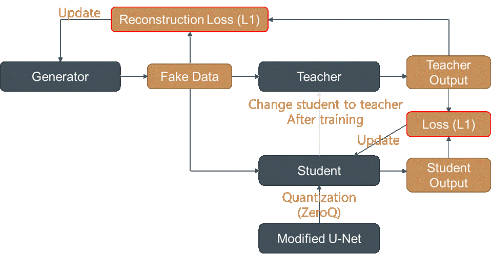

# Progressive Data-Free Quantization of Modified U-Net

## Introduction


This repository contains Progressive Data-Free Quantization of Modified U-Net for SISR.

If we consider quantization to 4-bit, we first set student model to 24-bit and train that model.   
After training 24-bit quantized model, we set this model to teacher and make new 16-bit student model.     
We repeat this process for 8-bit student and 4-bit student model. 

## Referece
### Code

[Mnster00/simplifiedUnetSR](https://github.com/Mnster00/simplifiedUnetSR)

[amirgholami/ZeroQ](https://github.com/amirgholami/ZeroQ)

[xushoukai/GDFQ](https://github.com/xushoukai/GDFQ)    

[huawei-noah/Efficient-Computing](https://github.com/huawei-noah/Efficient-Computing/tree/master/Data-Efficient-Model-Compression/DFSR)

### Paper

Lu, Z., & Chen, Y. (2021). Single image super-resolution based on a modified U-net with mixed gradient loss. Signal, Image and Video Processing, 1-9.   

Van Der Jeught, S., Muyshondt, P. G., & Lobato, I. (2021). Optimized loss function in deep learning profilometry for improved prediction performance. Journal of Physics: Photonics, 3(2), 024014.   

Xu, S., Li, H., Zhuang, B., Liu, J., Cao, J., Liang, C., & Tan, M. (2020, August). Generative low-bitwidth data free quantization. In European Conference on Computer Vision (pp. 1-17). Springer, Cham.   

Zhang, Y., Chen, H., Chen, X., Deng, Y., Xu, C., & Wang, Y. (2021). Data-free knowledge distillation for image super-resolution. In Proceedings of the IEEE/CVF Conference on Computer Vision and Pattern Recognition (pp. 7852-7861).

## Before Running
This code is tested on Windows 10.

### Download Dataset
Download [BSDS300](https://www2.eecs.berkeley.edu/Research/Projects/CS/vision/bsds/) image dataset.    
Unzip and put `bsds300` folder inside `dataset` folder.

### Make Folder for Saving Result
Make `result` folder at root directory of this repo.    
Make two folders named `original` and `prediction` inside `result` folder.     

### Settings for Quantization
For Data-free quantization, change `Unet/solver.py` line 52, `self.quant_bit = 6` value.    

For Progressive data-free quantization, change `Unet/solver.py` line 371, `quant_bits = [24, 18, 12, 6]` list value.

## Code Files
`main.py`: parse arguments.

`Unet/Umodel.py` and `Unet/unet_parts.py`: U-Net architecture.

`Unet/solver.py`: Training U-Net.

`Unet/zsnet_sr.py`: Generator architecture.

`quantizaton_utils/quant_modules.py` and `quantization_utils/quant_utils.py`: Quantization code.

`dataset/data.py` and `dataset/dataset.py`: Dataset loading.

## Run
```
python main.py -m unet -lr 0.001 -n 100 -b 16 --progressive 1
```

```
-b [batchSize]	
-t [testBatchSize]	
-seed [random seed]	
-uf [upscale_factor]	
-lr [learning rate]	
-n [epochs]
--progressive [0 | 1]
```